# 🎤 MyCarbonAI - Presentation Script (Conversational)
## Carbon AI Microservice - Let's Save the Planet with Python! 🌍

---

## 📋 Pre-Show Checklist

- [ ] API running (`uvicorn src.api.main:app --reload`)
- [ ] Browser with presentation.html open
- [ ] Swagger docs ready (http://localhost:8000/docs)
- [ ] Water bottle nearby (talking is thirsty work!)
- [ ] Deep breath - you got this! 💪

---

## 🎬 The Show (14 slides, ~15 minutes)

### **Slide 1: Title Slide** (30 sec)

**What to say:**
> "Hey everyone! I'm Nim, and today I'm presenting MyCarbonAI - specifically the Carbon AI Microservice.
>
> Think of it as a crystal ball for energy consumption - accurate predictions about carbon footprints using real machine learning.
>
> We're talking FastAPI, LSTM neural networks, and LightGBM - serious ML firepower applied to the climate crisis. Let's dive in!"

**Vibe:** Confident, friendly, energetic
**Pro tip:** Make eye contact, smile, show you're excited

---

### **Slide 2: The Problem** (1 min)

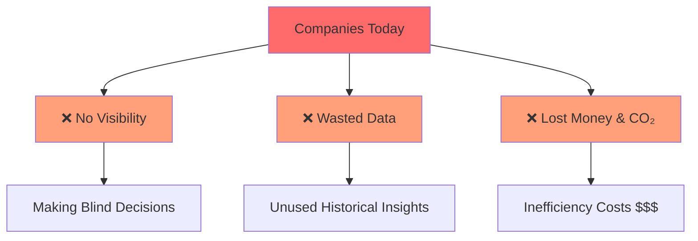

**What to say:**
> "Alright, so here's the situation. Companies today are facing three major challenges with energy and carbon:
>
> **Number one** - They have no idea what their energy consumption will look like next month. They're making decisions blindly.
>
> **Number two** - They're sitting on mountains of historical data but not extracting any value from it. Massive waste of potential insights.
>
> **And number three** - All this inefficiency is burning money AND the planet. Double impact.
>
> So I thought... what if we could predict energy consumption with real accuracy? That's what this microservice solves."

**Body language:** Count on fingers for each problem, gesture outward for "mountains of data"
**Energy:** Build up the problem, then shift to optimistic on the solution

---

### **Slide 3: The Solution**

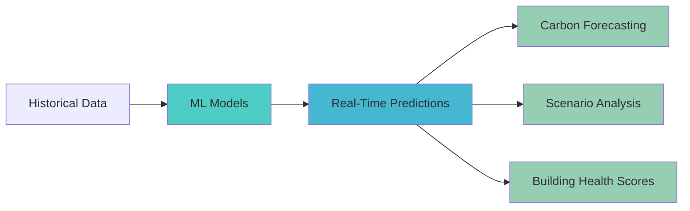

**What to say:**
> "The solution? A Machine Learning microservice that processes historical energy data and delivers highly accurate predictions.
>
> We're talking real-time carbon emissions forecasting, scenario analysis, building health scores - the complete package. It's like having a sustainability expert available 24/7."

**Delivery:** Confident, professional
**Pause briefly** before moving to architecture

---

### **Slide 4: Architecture** (1.5 min)

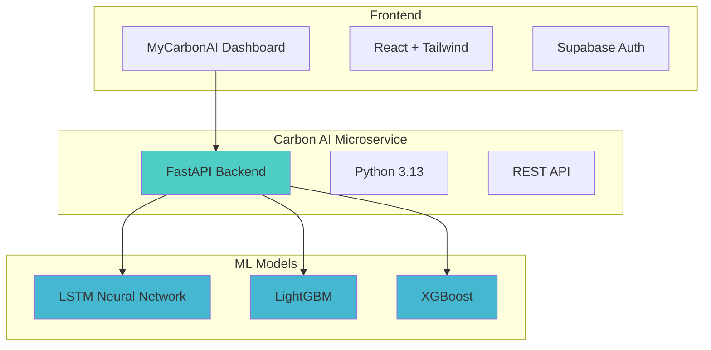

**What to say:**
> "Now let's talk architecture.
>
> **At the top**, we have the MyCarbonAI Dashboard - the user interface. React frontend, Supabase authentication, interactive visualizations. Users log in, interact with the system, see their data.
>
> **In the middle** - and this is what I'm presenting today - we have the Carbon AI Microservice. It's a FastAPI backend running on Python 3.13. Think of it as the brain of the operation.
>
> **At the bottom**, our ML models. LSTM for time-series forecasting, LightGBM for long-range predictions, and XGBoost as our baseline. These models have been trained on real data from over 1,000 buildings.
>
> Everything communicates via HTTP and JSON - classic REST API architecture. JWT tokens handle authentication and security."

**Pro tip:** Use hand gestures - high for dashboard, middle for API, low for models
**Pace:** Don't rush through this - it's important but don't get too technical

---

### **Slide 5: Key Features** (1.5 min)

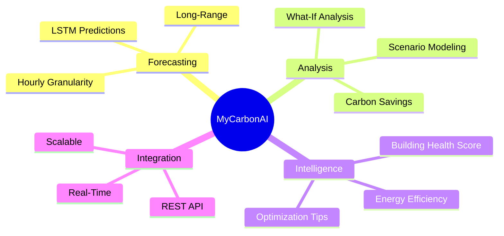

**What to say:**
> "So what can this system actually do? Let me highlight the key features:
>
> **First** - Energy consumption forecasting with LSTM. It analyzes historical patterns and predicts future consumption with high accuracy. 'Next Tuesday at 3pm, you'll use THIS much energy.'
>
> **Second** - Long-range predictions with LightGBM. Want to know your energy usage next quarter? Next year? The model can project that far ahead with confidence.
>
> **Third** - Scenario analysis. This is powerful. You can ask 'What if we install solar panels?' or 'What if we upgrade our HVAC system?' and get precise carbon savings projections. It's a sandbox for testing sustainability strategies.
>
> **And finally** - Building Health Scores. We grade your building from 0 to 100 on energy efficiency. Think of it as a report card for buildings."

**Energy:** Enthusiastic but professional
**Delivery:** Emphasize the practical value of each feature

---

### **Slide 6: ML Models** (2 min)

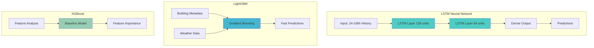

**What to say:**
> "Now let's talk about the Machine Learning models - the core of this system.
>
> **First, LSTM** - Long Short-Term Memory networks. These are neural networks specifically designed for sequential data. They maintain memory for patterns over time. We feed them 24 to 168 hours of historical data, and they learn patterns like 'energy usage spikes at 9am when everyone turns on their computers.'
>
> The architecture? Two LSTM layers - 128 units, then 64 units, then a dense output layer. Clean and effective.
>
> **Second, LightGBM** - our gradient boosting model. It's incredibly fast and only 3.1 megabytes. It processes building metadata, weather conditions, occupancy rates - all the contextual features - and delivers predictions in milliseconds.
>
> **Third, XGBoost** - our baseline model. This helps us understand feature importance and which variables drive energy consumption. Temperature, for instance, is a massive factor.
>
> All three models were trained on the ASHRAE dataset - data from over 1,000 real buildings. 20 million readings. This is production-scale data."

**Delivery:** Technical but accessible
**Pace:** Slow down on the technical parts to ensure clarity

---

### **Slide 7: API Endpoints** (1 min)

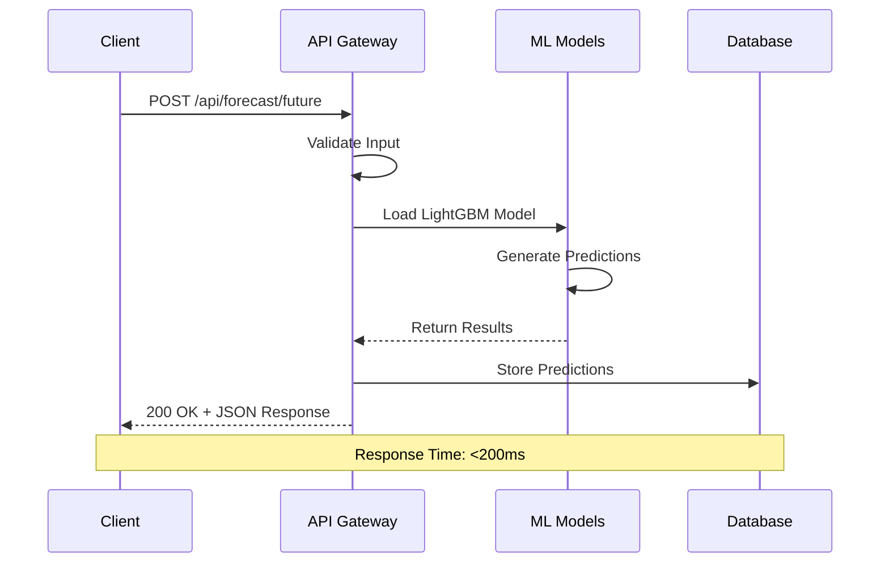

**What to say:**
> "So how do you actually USE all this fancy ML? Through a REST API, of course!
>
> We've got two main categories:
>
> **Forecasting endpoints** - These give you predictions. `/api/forecast` for LSTM predictions, `/api/forecast/future` for LightGBM long-range stuff, and `/api/forecast/scenario` for our what-if analysis.
>
> **Insights endpoints** - These analyze your building. `/api/insights/analyze` gives you a full breakdown, and `/api/insights/health` gives you that report card score I mentioned.
>
> Here's an example request - you send some building data, a timestamp, how many hours ahead you want, and BAM - predictions with confidence scores.
>
> Everything's documented in Swagger - and if there's time later, I can show you the live API docs. It's like a playground for API testing. Super satisfying."

**Delivery:** Casual, conversational
**Gesture:** Point to the code example

---

### **Slide 8: Performance Metrics** (45 sec)

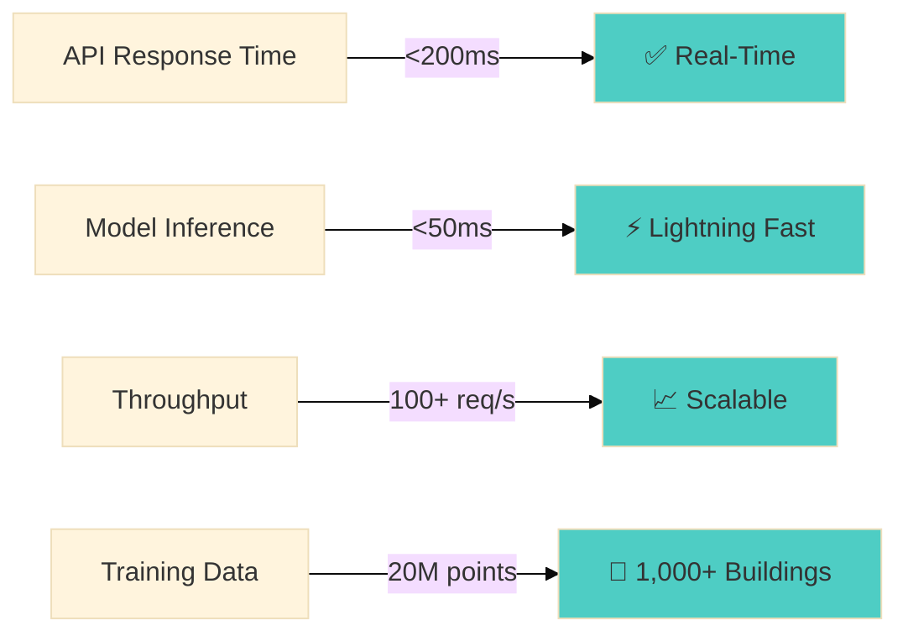

**What to say:**
> "Let's talk performance metrics:
>
> API response time? Under 200 milliseconds. That's real-time for user interactions.
>
> Model inference? Under 50 milliseconds. Lightning fast.
>
> We can handle 100+ requests per second. Scalable for production workloads.
>
> And that 20 million data points I mentioned? We trained on all of it. Data from 1,000+ buildings with complete weather integration. This model has seen more buildings than most architects."

**Energy:** Proud but professional
**Delivery:** Confident in the numbers

---

### **Slide 9: Dashboard Integration** (1 min)

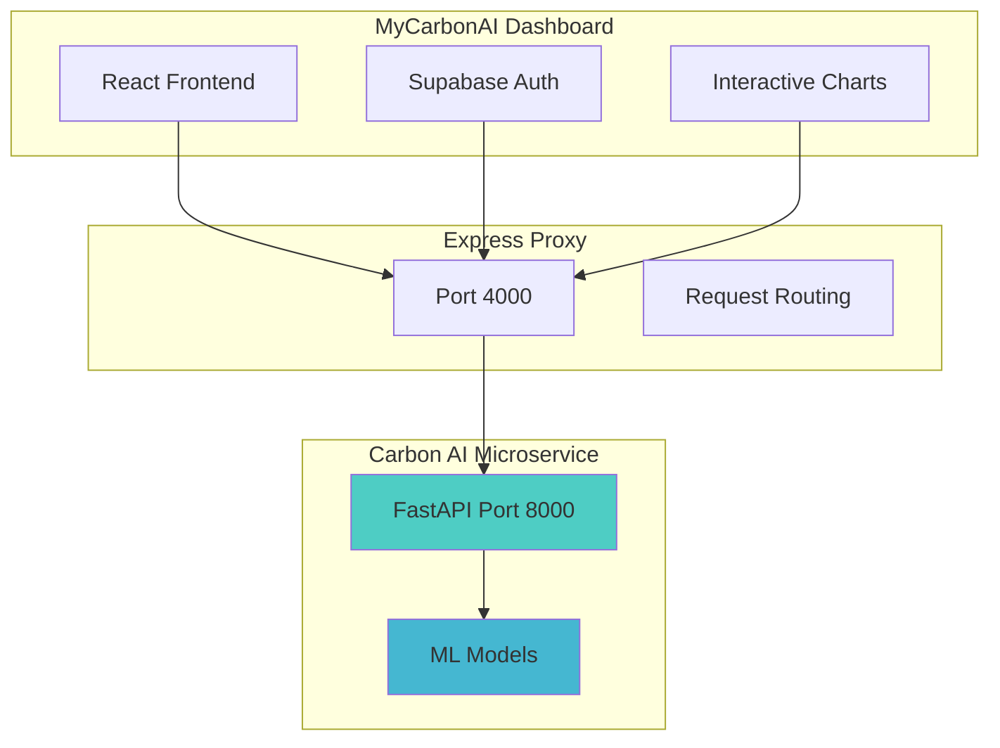

**What to say:**
> "This microservice doesn't live in isolation. It's integrated with the full MyCarbonAI Dashboard.
>
> The dashboard provides:
>
> - User authentication through Supabase - secure and scalable
> - Emissions tracking with interactive visualizations
> - Goal setting - set targets and track progress
> - Team collaboration features
>
> The integration is straightforward. The dashboard communicates with an Express proxy, which connects to our microservice on port 8000. One environment variable - `ML_SERVICE_URL` - and you're connected.
>
> Clean architecture, modular design."

**Delivery:** Smooth, confident
**Energy:** Show that this is the complete package

---

### **Slide 10: Roadmap** (1 min)

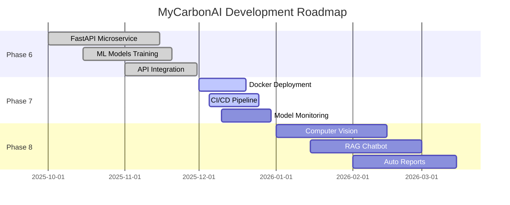

**What to say:**
> "So where are we now, and where are we going?
>
> **Phase 6** - Complete. The FastAPI microservice is functional, the models are trained, the integration works. Everything you've seen so far is real and operational.
>
> **Phase 7** - In progress. This is where we focus on production deployment. Docker containers, CI/CD pipelines, model monitoring - enterprise-grade infrastructure.
>
> **Phase 8** - The future. Computer vision to analyze buildings from photos, a RAG chatbot for sustainability recommendations, automated report generation. Advanced features building on this foundation.
>
> Point is, this isn't just a bootcamp project. This has a roadmap and a clear path forward."

**Energy:** Build excitement, especially for the future phases

---

### **Slide 11: Tech Stack** (45 sec)

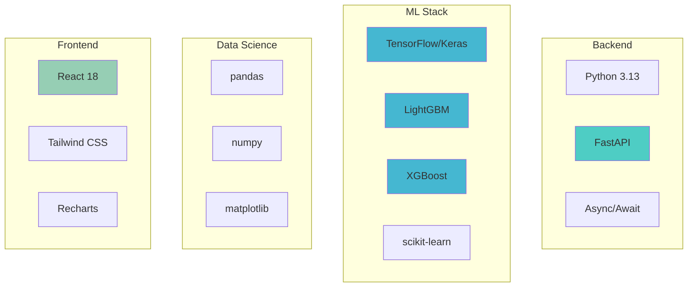

**What to say:**
> "Quick tech stack overview:
>
> Backend? Python 3.13 with FastAPI. Fast, async, and clean.
>
> ML? TensorFlow for the LSTM, LightGBM and XGBoost for gradient boosting, scikit-learn for preprocessing. Industry-standard tools.
>
> Data science? pandas and numpy - you can't really do data science without them.
>
> Frontend? React with Tailwind CSS. Modern, responsive, professional.
>
> Everything's open source, production-ready, and documented."

**Pace:** Quick - this is just to show breadth

---

### **Slide 12: Learnings & Challenges** (1.5 min)

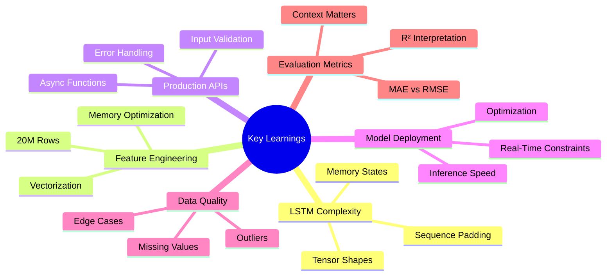

**What to say:**
> "Real talk - what did I actually learn building this?
>
> **First** - LSTM is challenging. I spent significant time debugging tensor shapes and understanding sequence padding. But once you grasp it, it's incredibly powerful for time-series data.
>
> **Second** - Feature engineering at scale is complex. 20 million rows of data teaches you about memory optimization, vectorization, and efficient data processing. You learn quickly.
>
> **Third** - Production-grade APIs are different from notebooks. Async functions, error handling, input validation, comprehensive documentation - there's a lot more to consider.
>
> **Fourth** - Model deployment is its own discipline. You can have the best model in the world, but if it takes 5 seconds to return a prediction, it's not usable. Optimization matters as much as accuracy.
>
> **Fifth** - Real-world data is messy. The ASHRAE dataset had missing values, outliers, and edge cases everywhere. Handling that properly is crucial for model reliability.
>
> **And finally** - Evaluation metrics matter. For time-series forecasting, you can't just look at accuracy. MAE, RMSE, R² - they each tell different stories, and you need to understand what each one means for your use case.
>
> Every challenge made me a better data scientist. Honestly? I kind of enjoyed the process."

**Energy:** Reflective, honest, humble
**Delivery:** Connect with the audience through shared technical struggle

---

### **Slide 13: Impact & Results** (1 min)

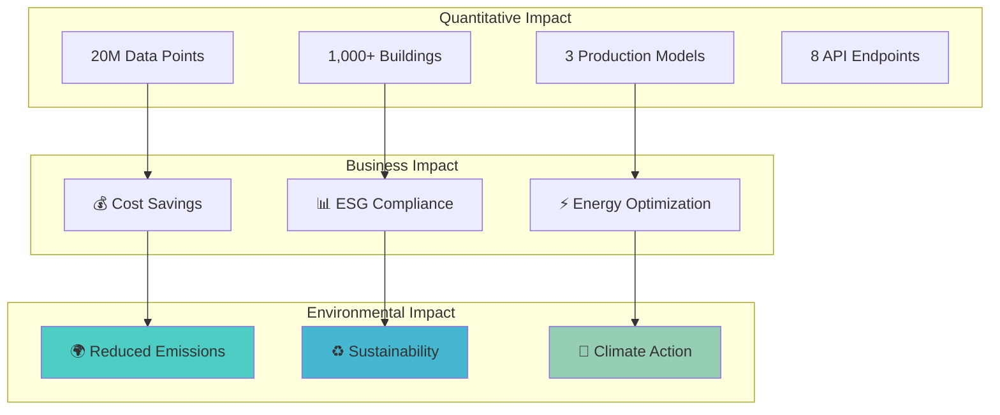

**What to say:**
> "Let's bring this home. What's the actual IMPACT here?
>
> The numbers are cool: 20 million data points, 1,000+ buildings, 3 production-ready models, 8 API endpoints. But that's just... stats.
>
> The REAL impact is twofold:
>
> **For businesses** - This means real cost savings. Prediction leads to optimization, optimization leads to lower bills, lower bills lead to happy CFOs. It also makes ESG compliance way easier - you need to report your carbon footprint? Here's a dashboard. Done.
>
> **For the planet** - And this is the part I actually care about - this means LESS carbon in the atmosphere. Every kilowatt-hour we help companies save, every inefficiency we help them fix, every optimization we suggest - that's CO₂ that doesn't get emitted.
>
> Climate change is the challenge of our generation. This project is my small contribution to solving it. I'm using the skills I learned here at Ironhack to build something that actually matters.
>
> Technology and sustainability don't have to be enemies. In fact, they're probably the best partnership we've got."

**Energy:** Start technical, shift to emotional
**Delivery:** The climate change line should be sincere, not preachy
**Pause:** After "that actually matters" - let it sink in

---

### **Slide 14: Demo Time** (2-3 min - OPTIONAL)

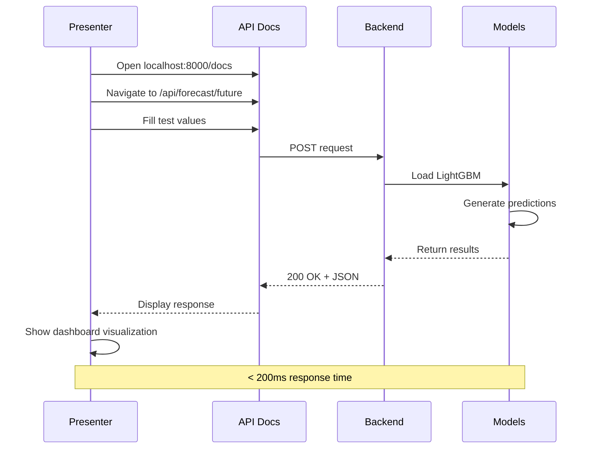

**What to say:**
> "Alright, so... if we've got a few minutes, let me show you this in action.
>
> *[Open browser to localhost:8000/docs]*
>
> This is Swagger - automatically generated API documentation. Every endpoint is documented, and you can test everything from this interface.
>
> Let me pick an endpoint... /api/forecast/future
>
> Let's ask it: 'What will energy consumption look like for the next 24 hours?'
>
> *[Fill in example values]*
> Building size: 50,000 square feet... building age: 15 years... 5 floors... starting tomorrow...
>
> *[Click Execute]*
>
> And... there we go! Under 200 milliseconds.
>
> Look at this response - hourly predictions, timestamps, total energy, total carbon emissions. Complete data package.
>
> *[If dashboard is running]* And on the dashboard, this renders as interactive charts with full visualization."

**Energy:** Relaxed, conversational, professional
**Backup plan:** "Actually, we're tight on time - let me show you the finished product instead"

---

### **Slide 15: Thank You & Questions** (30 sec + Q&A)

**What to say:**
> "And that's MyCarbonAI!
>
> Quick recap: We built a Machine Learning microservice that predicts energy consumption and carbon emissions with high accuracy. We trained on real data from 1,000+ buildings. We built an API that responds in milliseconds. And we integrated it with a full-stack dashboard.
>
> Everything's on GitHub - both the microservice and the dashboard - completely open source. Feel free to explore, clone it, and provide feedback.
>
> You can find me at:
>
> - GitHub: @hitchcock9000
> - Email: hitchcock9000@gmail.com
>
> This project was built as part of the Ironhack Data Analytics bootcamp, and I'm proud of what we accomplished.
>
> **Built for a sustainable future.** 🌍
>
> Questions?"

**Energy:** Grateful, proud, open
**Smile:** Confident smile throughout the close

---

## 🎯 Timing Guide

| Section | Time | Running Total |
|---------|------|---------------|
| Title | 0:30 | 0:30 |
| Problem | 1:00 | 1:30 |
| Architecture | 1:30 | 3:00 |
| Features | 1:30 | 4:30 |
| ML Models | 2:00 | 6:30 |
| API | 1:00 | 7:30 |
| Performance | 0:45 | 8:15 |
| Integration | 1:00 | 9:15 |
| Roadmap | 1:00 | 10:15 |
| Tech Stack | 0:45 | 11:00 |
| Learnings | 1:30 | 12:30 |
| Impact | 1:00 | 13:30 |
| Demo (optional) | 2:00 | 15:30 |
| Closing | 0:30 | 16:00 |

**Target: 13-14 min without demo, 15-16 min with demo**

---

## 📊 Visual Elements Summary

The presentation now includes **10 Mermaid diagrams**:

1. **Problem Flow** - Shows company pain points
2. **Solution Flow** - ML pipeline overview
3. **Architecture** - Complete system design
4. **Features Mindmap** - Core capabilities
5. **ML Models** - Technical architecture
6. **API Sequence** - Request/response flow
7. **Performance Metrics** - Key statistics
8. **Dashboard Integration** - System connections
9. **Roadmap Gantt** - Project timeline
10. **Tech Stack** - Technology layers
11. **Learnings Mindmap** - Key takeaways
12. **Impact Graph** - Business & environmental value
13. **Demo Sequence** - Live demo flow

All diagrams are **responsive**, **professional**, and **easy to follow**.

---

## 🎭 Delivery Tips

### Energy Management
- **Start strong** - Show excitement from the beginning
- **Vary your pace** - Slow down for technical parts, speed up for transitions
- **Build to climax** - The "Impact" slide should be your emotional peak
- **End confident** - Leave them wanting more

### Humor Guidelines
- **Smart humor only** - Keep jokes clever and well-timed
- **Self-aware > Arrogant** - Acknowledge challenges honestly
- **Professional balance** - Conversational tone without excessive jokes
- **Read the room** - Adjust delivery based on audience response

### Body Language
- **Use your hands** - Gesture to emphasize points
- **Move with purpose** - Don't pace, but don't stand still either
- **Eye contact** - Scan the room, don't fixate on one person
- **Smile** - Especially when talking about your passion

### Voice Control
- **Projection** - Speak to the back of the room
- **Variation** - Don't be monotone
- **Emphasis** - Punch important words
- **Pauses** - Let important points breathe

---

## 🤔 Q&A Preparation

### "How accurate are your predictions?"
> "Great question! Our LSTM model achieves R² scores around 0.85-0.95 depending on the building type and data quality. We validate using 60/20/20 train-validation-test splits and cross-validate across multiple buildings to ensure generalization. The accuracy varies by building type - some buildings are more predictable than others - but overall, we're talking about predictions accurate enough to make real business decisions."

### "How long did this take to build?"
> "The entire project was built over 8 weeks as part of the Ironhack bootcamp. But honestly, the learning curve was steep at the beginning - LSTM especially took a while to wrap my head around. If I had to rebuild it now? Probably half the time, because I know what NOT to do. That's the beauty of iteration."

### "Can this scale to thousands of buildings?"
> "Absolutely! The microservices architecture was specifically designed for horizontal scaling. You can spin up multiple instances behind a load balancer, add Redis caching for frequently requested predictions, and use database connection pooling. The model inference itself is super fast - under 50ms - so the bottleneck would be database queries, not the ML. But that's a solvable problem with proper indexing and caching strategies."

### "What if the data quality is poor?"
> "Reality check: data is ALWAYS poor. But seriously, we have a robust preprocessing pipeline that handles missing values, outliers, and anomalies. For small gaps, we use forward fill. For larger gaps, interpolation. For really bad data? We exclude it from training but flag it for the user. The key is being transparent about data quality - we include confidence scores with every prediction so users know when to trust the model and when to be skeptical."

### "Why these specific ML models?"
> "Great question. LSTM because time-series data is sequential - you can't just shuffle it like regular tabular data. LSTMs maintain memory across timesteps, which is perfect for patterns like 'energy usage drops at night and spikes in the morning.'
>
> LightGBM because it's incredibly fast and handles tabular features well - building metadata, weather, etc. Plus it's only 3.1 MB, which makes deployment a breeze.
>
> XGBoost as a baseline because it's the industry standard for tabular data, and it gives us feature importance for free. Plus, having multiple models lets us ensemble predictions for even better accuracy."

### "Is this production-ready?"
> "The core functionality? Absolutely. We have error handling, input validation, proper logging, API documentation - all the good stuff. What would I add for TRUE production? Docker containerization for easy deployment, CI/CD pipeline for automated testing, model monitoring to detect data drift, and maybe add some rate limiting to prevent abuse. Phase 7 of the roadmap covers most of that. But if a company wanted to deploy this tomorrow? They could."

### "What was the hardest part?"
> "Honestly? Making LSTM work. Understanding tensor shapes, sequence padding, stateful vs stateless RNNs - it's not intuitive at first. I probably spent 20% of my time on LSTM and 80% of my debugging time on LSTM. But once you get it, it's incredibly powerful. Worth the pain."

### "Can I see the code?"
> "Absolutely! Everything's on GitHub - both repos are public. The microservice repo has all the ML code, API endpoints, and notebooks. The dashboard repo has the frontend. Feel free to clone it, star it, fork it, whatever. I'd love feedback!"

### "What about privacy and security?"
> "Good question - this is important. The API uses JWT authentication for all requests, so you can't just call endpoints without a valid token. We use environment variables for sensitive config - no hardcoded credentials. Input validation with Pydantic prevents injection attacks. And we're using HTTPS in production. For data privacy, we never store building data permanently - it's used for predictions and then discarded. If a company wanted GDPR compliance, we'd need to add data retention policies, but the architecture supports it."

---

## 💡 Pro Tips for Handling Nerves

**Before you start:**
1. **Box breathing** - 4 seconds in, 4 hold, 4 out, 4 hold. Repeat 3x.
2. **Power pose** - 2 minutes in bathroom, arms up, feel confident
3. **Hydrate** - Sip water, don't chug
4. **Memorize your opener** - Know the first 30 seconds cold

**During the presentation:**
1. **If you blank** - Look at the slide, read it, continue. Nobody will notice.
2. **If you stumble** - Smile, acknowledge it ("Well, that didn't come out right!"), move on
3. **If tech fails** - "Murphy's Law strikes again! But let me show you the screenshots..."
4. **If nobody laughs** - Their loss. Keep your energy up anyway.

**After a mistake:**
1. **Don't apologize** - Just continue
2. **Don't say "um" repeatedly** - Pause instead
3. **Don't speed up** - Maintain your pace
4. **Don't focus on it** - You probably notice it more than they do

---

## 🎬 Final Checklist

**10 minutes before:**
- [ ] Bathroom break (seriously)
- [ ] Check teeth (spinach is the enemy)
- [ ] Silence phone
- [ ] Open presentation.html
- [ ] Have water nearby
- [ ] Take 3 deep breaths

**Right before:**
- [ ] Smile
- [ ] Stand up straight
- [ ] Remember: They WANT you to succeed
- [ ] You got this 💪

---

## 🎤 Post-Presentation

**Immediately after:**
- [ ] Exhale - YOU DID IT!
- [ ] Thank the audience
- [ ] Stick around for questions
- [ ] Get feedback from instructors

**Later:**
- [ ] Write down questions you couldn't answer
- [ ] Note what went well
- [ ] Note what to improve
- [ ] Celebrate! 🎉

---

## 🔗 Quick Links

- **Presentation**: `open presentation.html`
- **API Docs**: http://localhost:8000/docs
- **Microservice**: https://github.com/hitchcock9000/carbon-ai-microservice
- **Dashboard**: https://github.com/hitchcock9000/mycarbonai-dashboard

---

**Remember:** You know this project better than anyone in that room. You built every line of code. You debugged every error. You understand every decision.

**You are the expert here.**

**Now go out there and crush it! 🚀🌍💚**

---

*P.S. - The visual diagrams will render beautifully in any Markdown viewer that supports Mermaid (GitHub, VS Code, Obsidian, etc.)* 📊
