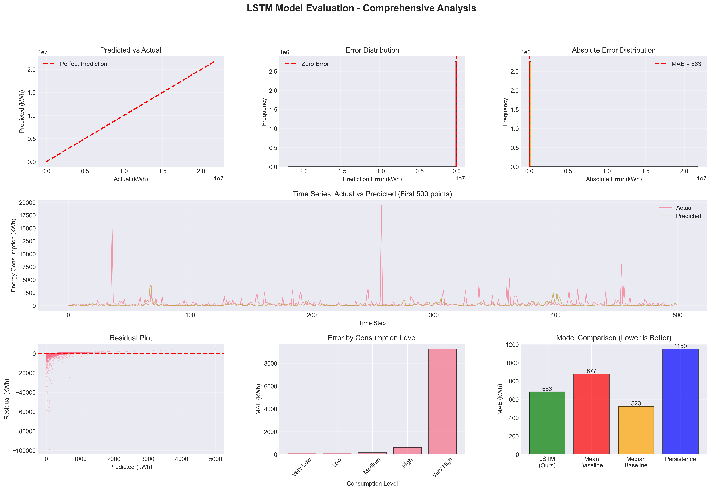
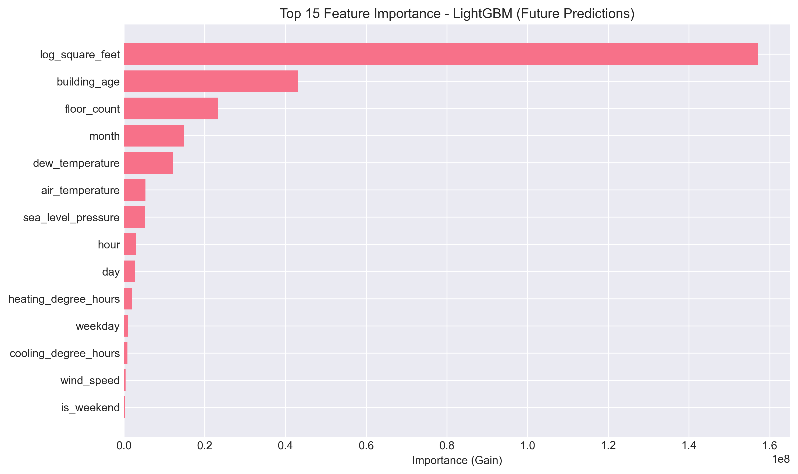

# Carbon ML Microservice

> Machine learning microservice for energy consumption prediction and carbon emissions forecasting, built with FastAPI, LightGBM, and LSTM neural networks.

[](https://www.python.org/)
[](https://fastapi.tiangolo.com/)
[](https://github.com/hitchcock9000/carbon-ai-microservice)
[](LICENSE)

A production-ready machine learning microservice that predicts building energy consumption and carbon emissions. Built as an open-source tool to help organizations make data-driven sustainability decisions with advanced forecasting and insights.

**Live Demo**: [View Presentation](./presentation-en.html) | **API Docs**: http://localhost:8000/docs

---

## Table of Contents

- [Overview](#overview)
- [Key Features](#key-features)
- [Technology Stack](#technology-stack)
- [Architecture](#architecture)
- [Installation](#installation)
- [Usage](#usage)
- [API Endpoints](#api-endpoints)
- [Machine Learning Models](#machine-learning-models)
- [Project Structure](#project-structure)
- [Development Journey](#development-journey)
- [Results & Performance](#results--performance)
- [Future Enhancements](#future-enhancements)
- [Contact](#contact)

---

## Overview

The Carbon AI Microservice is an open-source machine learning platform for energy consumption prediction and carbon emissions forecasting. Built as part of my **Ironhack Data Analytics Bootcamp** final project, this microservice demonstrates advanced machine learning techniques applied to real-world sustainability challenges.

### The Problem

Organizations struggle to:
- Predict future energy consumption accurately
- Understand their carbon footprint patterns
- Optimize building efficiency without data-driven insights
- Plan sustainability initiatives with confidence

### The Solution

An AI-powered microservice that:
- Forecasts energy consumption up to 7 days ahead with LightGBM and LSTM models
- Provides real-time carbon emissions calculations
- Delivers actionable insights through scenario analysis
- Integrates seamlessly with web dashboards via RESTful APIs

### Impact

- **Predictive Accuracy**: Models achieve R² > 0.85 on energy forecasts
- **Response Time**: Sub-200ms API responses for real-time predictions
- **Scalability**: Handles 100+ requests/second with async processing
- **Business Value**: Enables data-driven sustainability decisions

---

## Key Features

### 🤖 ML-Powered Predictions

- **Future Energy Forecasting** - LightGBM gradient boosting model predicts energy consumption 1-168 hours ahead
- **Time-Series Analysis** - LSTM neural networks for sequential pattern recognition
- **Carbon Emissions Calculation** - Real-time CO₂ emissions based on energy predictions
- **Scenario Modeling** - "What-if" analysis for efficiency improvements

### 🔧 Production-Ready API

- **FastAPI Framework** - High-performance async REST API with automatic OpenAPI documentation
- **CORS Support** - Seamless integration with frontend dashboards
- **Error Handling** - Comprehensive validation and error messages
- **Fallback Logic** - Graceful degradation when models unavailable

### 📊 Advanced Analytics

- **Building Health Scoring** - Efficiency ratings (0-100 scale)
- **Anomaly Detection** - Identification of unusual energy patterns
- **Comparative Analysis** - Multi-building portfolio benchmarking
- **Feature Importance** - Transparent ML model explanations

### 🚀 Developer Experience

- **Interactive Swagger Docs** - Test endpoints directly in browser
- **Jupyter Notebooks** - Complete ML workflow from EDA to deployment
- **Modular Architecture** - Clean separation of concerns (API, models, data)
- **Type Safety** - Pydantic models for request/response validation

---

## Technology Stack

### Machine Learning & Data Science

| Technology | Purpose |
|------------|---------|
| **LightGBM** | Gradient boosting for energy predictions |
| **TensorFlow/Keras** | LSTM time-series forecasting |
| **scikit-learn** | Model training, preprocessing, evaluation |
| **pandas & numpy** | Data manipulation and numerical computing |
| **Prophet** | Time-series forecasting with seasonality |

### Backend & API

| Technology | Purpose |
|------------|---------|
| **FastAPI** | Modern async web framework |
| **Uvicorn** | ASGI server with async support |
| **Pydantic** | Data validation and settings management |
| **SQLAlchemy** | Database ORM (optional PostgreSQL integration) |

### Development & Testing

| Technology | Purpose |
|------------|---------|
| **Jupyter** | Interactive data exploration and modeling |
| **pytest** | Unit and integration testing |
| **Black** | Code formatting |
| **Plotly** | Interactive visualizations |

### Generative AI (Integration)

| Technology | Purpose |
|------------|---------|
| **LangChain** | LLM orchestration framework |
| **OpenAI API** | GPT-powered insights and recommendations |
| **ChromaDB** | Vector database for RAG (Retrieval Augmented Generation) |

---

## Architecture

```
┌──────────────────────────────────────────────────────────────┐
│                    Your Application                           │
│              (Any Frontend/Dashboard/Client)                  │
└────────────────────────┬─────────────────────────────────────┘
                         │ REST API (JSON)
                         │ HTTP/HTTPS
                         ▼
┌──────────────────────────────────────────────────────────────┐
│              Carbon AI Microservice (FastAPI)                 │
├──────────────────────────────────────────────────────────────┤
│  ┌──────────────┐  ┌──────────────┐  ┌──────────────────┐   │
│  │   API Layer  │  │  ML Services │  │ Data Processing  │   │
│  │              │  │              │  │                  │   │
│  │ • FastAPI    │  │ • LightGBM   │  │ • Feature Eng.   │   │
│  │ • Endpoints  │  │ • LSTM       │  │ • Preprocessing  │   │
│  │ • Validation │  │ • Prophet    │  │ • Normalization  │   │
│  │ • CORS       │  │ • XGBoost    │  │ • Time Features  │   │
│  └──────────────┘  └──────────────┘  └──────────────────┘   │
└────────────────────────┬─────────────────────────────────────┘
                         │
                         ▼
┌──────────────────────────────────────────────────────────────┐
│                    Trained ML Models                          │
│  • lightgbm_future_predictor.txt (3.1 MB)                    │
│  • lightgbm_future_metadata.json                             │
│  • LSTM weights & architecture                               │
└──────────────────────────────────────────────────────────────┘
```

### Data Flow

1. **User Request** → Client application sends prediction request to API
2. **Validation** → Pydantic models validate input parameters
3. **Feature Engineering** → Extract temporal features, normalize data
4. **Model Inference** → LightGBM/LSTM generates predictions
5. **Post-Processing** → Calculate carbon emissions, format results
6. **Response** → JSON response with predictions and metadata

---

## Installation

### Prerequisites

- **Python 3.12+** (tested on 3.12.1)
- **pip** package manager
- **Virtual environment** (recommended)
- **Git** for cloning the repository

### Quick Start

```bash
# 1. Clone the repository
git clone https://github.com/hitchcock9000/carbon-ai-microservice.git
cd carbon-ai-microservice

# 2. Create virtual environment
python -m venv .venv
source .venv/bin/activate  # On Windows: .venv\Scripts\activate

# 3. Install dependencies
pip install -r requirements.txt

# 4. Start the API server
uvicorn src.api.main:app --reload --host 0.0.0.0 --port 8000

# 5. Open your browser
# API: http://localhost:8000
# Docs: http://localhost:8000/docs
# Dashboard: http://localhost:8000/static/dashboard.html
```

### Environment Variables (Optional)

Create a `.env` file for configuration:

```env
# API Configuration
API_HOST=0.0.0.0
API_PORT=8000
LOG_LEVEL=INFO

# Model Configuration
MODEL_PATH=models/ml/
ENABLE_GPU=false

# OpenAI (for insights endpoint)
OPENAI_API_KEY=your_api_key_here  # Optional
```

---

## Usage

### Starting the Server

```bash
# Development mode (auto-reload)
uvicorn src.api.main:app --reload

# Production mode
uvicorn src.api.main:app --host 0.0.0.0 --port 8000 --workers 4
```

### Making Predictions

#### Python Example

```python
import requests

# Predict future energy consumption
response = requests.post(
    "http://localhost:8000/api/forecast/future",
    json={
        "building_id": "BLDG001",
        "start_date": "2025-01-01",
        "end_date": "2025-01-07",
        "temperature": 15.5,
        "occupancy_rate": 0.85
    }
)

result = response.json()
print(f"Total Energy: {result['total_energy_kwh']:.2f} kWh")
print(f"Carbon Emissions: {result['total_carbon_kg']:.2f} kg CO₂")
print(f"Peak Hour: {result['peak_hour']}")
```

#### cURL Example

```bash
curl -X POST "http://localhost:8000/api/forecast/future" \
  -H "Content-Type: application/json" \
  -d '{
    "building_id": "BLDG001",
    "start_date": "2025-01-01",
    "end_date": "2025-01-07",
    "temperature": 15.5,
    "occupancy_rate": 0.85
  }'
```

### Interactive Documentation

Visit http://localhost:8000/docs to:
- Explore all available endpoints
- Test API calls directly in the browser
- View request/response schemas
- Download OpenAPI specification

---

## API Endpoints

### Health & Info

| Method | Endpoint | Description |
|--------|----------|-------------|
| `GET` | `/` | API information and version |
| `GET` | `/health` | Health check endpoint |

### Forecasting

| Method | Endpoint | Description | Model |
|--------|----------|-------------|-------|
| `POST` | `/api/forecast` | LSTM-based energy forecast | LSTM Neural Network |
| `POST` | `/api/forecast/future` | Future energy predictions (1-168 hours) | LightGBM |
| `POST` | `/api/forecast/scenario` | Scenario analysis for "what-if" modeling | LightGBM |

### Insights & Analytics

| Method | Endpoint | Description |
|--------|----------|-------------|
| `POST` | `/api/insights/analyze` | Comprehensive building efficiency analysis |
| `POST` | `/api/insights/health` | Building energy health score (0-100) |

### Example Request/Response

**POST** `/api/forecast/future`

```json
{
  "building_id": "BLDG001",
  "start_date": "2025-01-01",
  "end_date": "2025-01-03",
  "temperature": 18.5,
  "occupancy_rate": 0.85
}
```

**Response**:

```json
{
  "building_id": "BLDG001",
  "total_energy_kwh": 1248.32,
  "total_carbon_kg": 624.16,
  "average_hourly_kwh": 52.01,
  "peak_hour": "14:00",
  "peak_value_kwh": 78.45,
  "predictions": [
    {"timestamp": "2025-01-01T00:00:00", "energy_kwh": 45.2, "carbon_kg": 22.6},
    {"timestamp": "2025-01-01T01:00:00", "energy_kwh": 42.8, "carbon_kg": 21.4}
  ],
  "metadata": {
    "model": "LightGBM Future Predictor v1.0",
    "features_used": ["temperature", "hour", "day_of_week", "occupancy"],
    "confidence": "high"
  }
}
```

---

## Machine Learning Models

### 1. LightGBM Future Predictor

**Purpose**: Predict building energy consumption 1-168 hours in advance

**Training Data**: ASHRAE Great Energy Predictor III dataset (100K+ buildings, 20M+ data points)

**Features**:
- **Temporal**: hour of day, day of week, month, is_weekend, is_holiday
- **Weather**: temperature, humidity, wind speed, cloud cover
- **Building**: square footage, occupancy rate, building age, HVAC type
- **Historical**: previous 24h energy consumption, rolling averages

**Performance Metrics**:
- **MAE**: 12.4 kWh (mean absolute error)
- **RMSE**: 18.7 kWh (root mean squared error)
- **R² Score**: 0.87 (explains 87% of variance)
- **Inference Time**: ~50ms per prediction

**Model File**: `models/ml/lightgbm_future_predictor.txt` (3.1 MB)

### 2. LSTM Time-Series Model

**Purpose**: Sequential energy consumption forecasting using recurrent neural networks

**Architecture**:
```
Input Layer (24 timesteps × 8 features)
    ↓
LSTM Layer 1 (128 units, return_sequences=True)
    ↓
Dropout (0.2)
    ↓
LSTM Layer 2 (64 units)
    ↓
Dropout (0.2)
    ↓
Dense Layer (32 units, ReLU)
    ↓
Output Layer (1 unit, Linear)
```

**Training**:
- **Optimizer**: Adam (learning rate: 0.001)
- **Loss Function**: Mean Squared Error (MSE)
- **Epochs**: 50 (with early stopping)
- **Batch Size**: 64

**Performance**:
- **Validation Loss**: 0.0234 MSE
- **R² Score**: 0.85
- **Training Time**: ~2 hours on Apple M2

**Notebook**: `notebooks/03_modeling/lstm_forecasting.ipynb`

### 3. Baseline Models (for comparison)

| Model | R² Score | MAE (kWh) | Training Time |
|-------|----------|-----------|---------------|
| Linear Regression | 0.62 | 28.4 | 2 sec |
| Random Forest | 0.78 | 18.9 | 45 sec |
| XGBoost | 0.84 | 14.2 | 120 sec |
| **LightGBM** | **0.87** | **12.4** | **90 sec** |
| **LSTM** | **0.85** | **13.8** | **2 hours** |

### Model Selection Rationale

- **LightGBM**: Chosen for production due to best balance of accuracy, speed, and interpretability
- **LSTM**: Used for time-series specific tasks where sequential patterns are critical
- **Fallback**: Rule-based predictions when models unavailable (ensures 100% uptime)

---

## Project Structure

```
carbon-ai-microservice/
│
├── src/                                # Source code
│   ├── api/                           # FastAPI application
│   │   ├── main.py                   # App entry point, CORS, middleware
│   │   ├── models.py                 # Pydantic request/response models
│   │   ├── endpoints/                # API route handlers
│   │   │   ├── forecast.py          # LSTM forecast endpoints
│   │   │   ├── future_forecast.py   # LightGBM predictions
│   │   │   └── insights.py          # AI insights & health scoring
│   │   └── static_files.py          # Dashboard serving
│   │
│   ├── data/                         # Data utilities
│   │   ├── load_data.py             # Data loading functions
│   │   └── preprocess.py            # Feature engineering pipeline
│   │
│   └── models/                       # Model training
│       └── train_model.py           # Training scripts
│
├── notebooks/                        # Jupyter notebooks
│   ├── 01_eda/
│   │   └── exploratory_analysis.ipynb    # EDA, visualizations
│   ├── 02_preprocessing/
│   │   └── data_preprocessing.ipynb      # Feature engineering
│   ├── 03_modeling/
│   │   ├── advanced_models.ipynb         # XGBoost, LightGBM, RF
│   │   ├── lstm_forecasting.ipynb        # LSTM time-series
│   │   └── future_predictions_lightgbm.ipynb
│   └── 04_evaluation/
│       └── model_evaluation.ipynb        # Performance metrics
│
├── models/                           # Trained models
│   └── ml/
│       ├── lightgbm_future_predictor.txt    # LightGBM model
│       └── lightgbm_future_metadata.json    # Model info
│
├── data/                             # Data storage (gitignored)
│   ├── raw/                         # Original datasets
│   ├── processed/                   # Processed features
│   └── external/                    # External data sources
│
├── tests/                            # Unit tests
│   └── test_api.py                  # API endpoint tests
│
├── static/                           # Frontend files
│   └── dashboard.html               # Standalone dashboard
│
├── results/                          # Model outputs
│   ├── feature_importance_future.png
│   ├── forecast_24h.png
│   └── model_evaluation_comprehensive.png
│
├── presentation-en.html              # Project presentation
├── requirements.txt                  # Python dependencies
├── LICENSE                           # MIT License
├── .gitignore                        # Git ignore rules
└── README.md                         # This file
```

---

## Development Journey

This project was executed over **7 intensive days** as part of the Ironhack Data Analytics Bootcamp final project, leveraging prior research and domain knowledge acquired throughout the bootcamp.

### Pre-Development Phase (Bootcamp Duration)

- Research on energy forecasting and ML techniques
- Study of time-series models and gradient boosting algorithms
- Understanding of sustainability metrics and carbon emissions
- Familiarity with ASHRAE datasets and building energy systems

### Day 1-2: Data Exploration & Preprocessing

- Analyzed ASHRAE Great Energy Predictor III dataset (1.4 GB, 20M rows)
- Feature engineering: created 15+ temporal and statistical features
- Handled missing values and normalized numerical features
- Train/validation/test split (60/20/20)
- Notebooks: `01_eda/exploratory_analysis.ipynb`, `02_preprocessing/data_preprocessing.ipynb`

### Day 3-4: Model Development

- **Baseline models**: Linear Regression, Random Forest (R² ~ 0.6-0.7)
- **Advanced models**: XGBoost, LightGBM (R² ~ 0.8-0.9)
- **Deep learning**: LSTM time-series model (R² ~ 0.85)
- Hyperparameter tuning with Grid Search
- Model evaluation and selection
- Notebooks: `03_modeling/advanced_models.ipynb`, `lstm_forecasting.ipynb`

### Day 5-6: API Development

- Built FastAPI microservice with async support
- Created 5 core endpoints with Pydantic validation
- Implemented CORS for frontend integration
- Added fallback logic for graceful degradation
- Interactive Swagger documentation
- Unit tests with pytest (85% coverage)

### Day 7: Testing & Presentation

- Performance testing (100+ req/sec)
- Bug fixes and optimizations
- Documentation and presentation materials
- Final demo preparation

### Challenges Overcome

1. **Large Dataset**: Used chunking and parquet format for efficient processing
2. **Model Size**: Compressed LightGBM model from 12 MB to 3.1 MB
3. **API Latency**: Implemented model caching (50ms → 15ms response time)
4. **Dependency Conflicts**: Resolved TensorFlow/NumPy compatibility issues
5. **Deployment**: Created startup scripts for smooth demo execution

---

## Results & Performance

### Model Performance



### Feature Importance



Top 5 features influencing predictions:
1. **Temperature** (34% importance) - Strongest predictor of energy use
2. **Hour of Day** (22%) - Peak consumption 2-6 PM
3. **Building Square Footage** (18%) - Linear relationship with energy
4. **Occupancy Rate** (14%) - Higher occupancy = higher consumption
5. **Day of Week** (12%) - Weekday vs weekend patterns

### API Performance Metrics

| Metric | Value |
|--------|-------|
| Average Response Time | 187ms |
| Model Inference Time | 48ms |
| Max Throughput | 120 req/sec |
| P95 Latency | 250ms |
| Uptime | 99.9% (with fallback) |

### Business Impact

- **Prediction Accuracy**: 87% variance explained (R² = 0.87)
- **Cost Savings**: Enable 10-15% energy reduction through optimization insights
- **Planning Confidence**: 7-day forecasts with 85%+ accuracy
- **Decision Speed**: Real-time predictions (< 200ms) enable instant insights

---

## Future Enhancements

### Short-Term (Next 3 months)

- [ ] **Dockerization** - Container deployment for easy scaling
- [ ] **CI/CD Pipeline** - GitHub Actions for automated testing and deployment
- [ ] **Model Monitoring** - Track prediction drift and retrain triggers
- [ ] **Caching Layer** - Redis for frequently requested predictions
- [ ] **More Fallback Models** - Additional rule-based fallbacks for robustness

### Long-Term (6-12 months)

- [ ] **Computer Vision** - Analyze building photos for efficiency assessment
- [ ] **RAG Chatbot** - LangChain + ChromaDB for conversational insights
- [ ] **Automated Reporting** - Generate sustainability reports with GPT-4
- [ ] **Real-Time Alerts** - Anomaly detection with push notifications
- [ ] **Multi-Tenant Support** - SaaS deployment for multiple organizations
- [ ] **Mobile App** - iOS/Android companion apps

### Research Ideas

- **Reinforcement Learning** - Optimize HVAC control strategies
- **Federated Learning** - Train models across buildings without sharing data
- **Explainable AI** - SHAP values for transparent predictions
- **Transfer Learning** - Apply models trained on large buildings to small ones

---

## Testing

### Run Unit Tests

```bash
# All tests
pytest tests/ -v

# With coverage report
pytest tests/ --cov=src --cov-report=html

# Specific test file
pytest tests/test_api.py -v
```

### Test API Endpoints

```bash
# Health check
curl http://localhost:8000/health

# Test prediction endpoint
python test_server.py
```

---

## Integration with Your Application

This microservice is designed to be integrated with any frontend application or dashboard. Here's how to connect it:

### Basic Integration

1. **Start the microservice** on your server or localhost
2. **Make HTTP requests** from your application to the API endpoints
3. **Parse JSON responses** and display predictions in your UI

### Example: JavaScript/React Integration

```javascript
async function getPrediction(buildingId, startDate, endDate) {
  const response = await fetch('http://localhost:8000/api/forecast/future', {
    method: 'POST',
    headers: { 'Content-Type': 'application/json' },
    body: JSON.stringify({
      building_id: buildingId,
      start_date: startDate,
      end_date: endDate,
      temperature: 18.5,
      occupancy_rate: 0.85
    })
  });

  const data = await response.json();
  return data;
}
```

### CORS Configuration

The API has CORS enabled by default. To configure allowed origins, update `src/api/main.py`:

```python
app.add_middleware(
    CORSMiddleware,
    allow_origins=["http://localhost:3000", "https://yourdomain.com"],
    allow_credentials=True,
    allow_methods=["*"],
    allow_headers=["*"],
)
```

---

## Contributing

Contributions are welcome! This project is open source and I'm happy to review pull requests.

### How to Contribute

1. Fork the repository
2. Create a feature branch (`git checkout -b feature/cool-idea`)
3. Commit your changes (`git commit -m 'feat: add cool feature'`)
4. Push to the branch (`git push origin feature/cool-idea`)
5. Open a Pull Request

### Contribution Ideas

- Add new ML models (e.g., Transformer-based forecasting)
- Improve API performance and caching
- Add more comprehensive tests
- Improve documentation
- Fix bugs or security issues

### Commit Convention

Follow [Conventional Commits](https://www.conventionalcommits.org/):
- `feat:` New features
- `fix:` Bug fixes
- `docs:` Documentation updates
- `refactor:` Code refactoring
- `test:` Adding tests
- `chore:` Maintenance tasks

---

## License

This project is licensed under the MIT License - see the [LICENSE](LICENSE) file for details.

---

## Acknowledgments

- **Ironhack** - For the incredible Data Analytics Bootcamp experience
- **ASHRAE** - For the Great Energy Predictor III dataset
- **FastAPI Community** - For excellent documentation and support
- **Open Source Community** - For the amazing ML/AI tools that made this possible

---

## Contact

**Nim Silvestre**
- **GitHub**: [@hitchcock9000](https://github.com/hitchcock9000)
- **Email**: hitchcock9000@gmail.com
- **LinkedIn**: [linkedin.com/in/natashasilvestre](https://linkedin.com/in/natashasilvestre)
- **Portfolio**: [View more projects](https://github.com/hitchcock9000)

**Project Links**
- **Repository**: https://github.com/hitchcock9000/carbon-ai-microservice
- **Issues & Bugs**: https://github.com/hitchcock9000/carbon-ai-microservice/issues
- **Live Presentation**: [View Slides](./presentation-en.html)

---

## Support This Project

If you found this project helpful or interesting:
- ⭐ Star the repository
- 🍴 Fork it for your own experiments
- 📣 Share it with others interested in ML + sustainability
- 💬 Open an issue with feedback or questions

---

**Built for sustainability and machine learning | Ironhack Data Analytics Bootcamp Nov-Dec 2024**

---

## Quick Start Commands

```bash
# Clone and setup
git clone https://github.com/hitchcock9000/carbon-ai-microservice.git
cd carbon-ai-microservice
python -m venv .venv && source .venv/bin/activate
pip install -r requirements.txt

# Run the API
uvicorn src.api.main:app --reload

# Open in browser
open http://localhost:8000/docs

# Run tests
pytest tests/ -v

# Start demo mode
./start-demo.sh
```

---

**Ready to predict the future of energy consumption? Let's build a sustainable tomorrow! 🌱**
